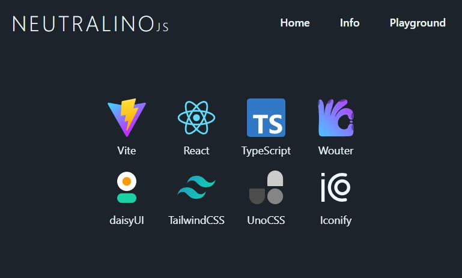

# 🥱 Yet Another Neutralinojs Starter

**Highly non-opinionated** starter for building a desktop applications using
[Neutralinojs](https://neutralino.js.org/docs/)

- [Vite](https://vite.dev/) with
  [Hot Module Replacement](https://vitejs.dev/guide/features#hot-module-replacement)
  for fast development
- [React](https://react.dev/) for building user interfaces
- [TypeScript](https://www.typescriptlang.org/) for type safety
- [Wouter](https://github.com/molefrog/wouter) for routing
- [TailwindCSS](https://tailwindcss.com/) and [UnoCSS](https://unocss.dev/) for
  styling
- [daisyUI](https://daisyui.com/) with its awesome
  [components](https://daisyui.com/components/) and
  [themes](https://daisyui.com/docs/themes/)
- [Iconify](https://iconify.design/) with tons of vector icons

# ⚡️ How to run

1. Install [BUN](https://bun.sh/)
2. Install
   [Neutralinojs CLI](https://neutralino.js.org/docs/#/setup/installation)
   globally with `bun i -g @neutralinojs/neu`
3. Clone this repository
4. Install all dependencies with `bun run install`
5. Run the app in development mode with `neu run`
6. Build the app for production with `neu build`

# 📑 TODO

- [ ] Make the "Playground" page better
- [ ] Make this starter compatible with other JS Runtimes
- [ ] Make this starter compatible with Neu's `--template` option
- [ ] Add theme switcher

# 🛸 Contributing

If you want to contribute to this project, please do it on the
[NEXT](https://github.com/Avaray/yet-another-neutralinojs-starter/tree/next)
branch.
